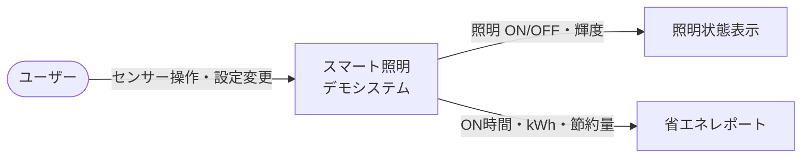
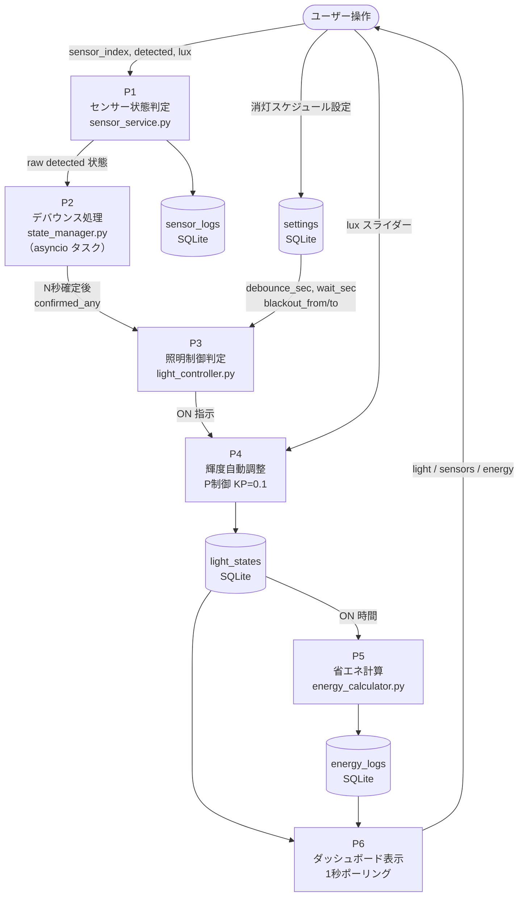
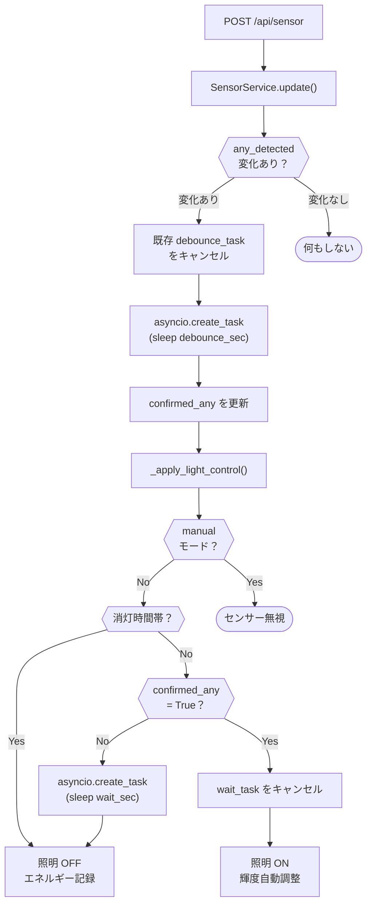

# DFD（データフロー図）

## レベル 0 — コンテキスト図

```mermaid
flowchart LR
    User(["ユーザー"])
    Sys["スマート照明\nデモシステム"]
    LightDisp["照明状態表示"]
    EnergyDisp["省エネレポート"]

    User -->|"センサー操作・設定変更"| Sys
    Sys -->|"照明 ON/OFF・輝度"| LightDisp
    Sys -->|"ON時間・kWh・節約量"| EnergyDisp
```

---

## レベル 1 — 主要プロセス

```mermaid
flowchart TD
    UI(["ユーザー操作"])

    P1["P1\nセンサー状態判定\nsensor_service.py"]
    P2["P2\nデバウンス処理\nstate_manager.py\n（asyncio タスク）"]
    P3["P3\n照明制御判定\nlight_controller.py"]
    P4["P4\n輝度自動調整\nP制御 KP=0.1"]
    P5["P5\n省エネ計算\nenergy_calculator.py"]
    P6["P6\nダッシュボード表示\n1秒ポーリング"]

    DS_sensor[("sensor_logs\nSQLite")]
    DS_light[("light_states\nSQLite")]
    DS_energy[("energy_logs\nSQLite")]
    DS_settings[("settings\nSQLite")]

    UI -->|"sensor_index, detected, lux"| P1
    P1 --> DS_sensor
    P1 -->|"raw detected 状態"| P2
    P2 -->|"N秒確定後\nconfirmed_any"| P3
    DS_settings -->|"debounce_sec, wait_sec\nblackout_from/to"| P3
    UI -->|"消灯スケジュール設定"| DS_settings
    P3 -->|"ON 指示"| P4
    UI -->|"lux スライダー"| P4
    P4 --> DS_light
    DS_light -->|"ON 時間"| P5
    P5 --> DS_energy
    DS_light --> P6
    DS_energy --> P6
    P6 -->|"light / sensors / energy"| UI
```

---

## レベル 2 — デバウンス & タイマー詳細

```mermaid
flowchart TD
    SensorIn["POST /api/sensor"]
    Update["SensorService.update()"]
    AnyDetected{{"any_detected\n変化あり？"}}
    CancelDebounce["既存 debounce_task\nをキャンセル"]
    StartDebounce["asyncio.create_task\n(sleep debounce_sec)"]
    Confirm["confirmed_any を更新"]
    ApplyLight["_apply_light_control()"]
    IsManual{{"manual\nモード？"}}
    IsBlackout{{"消灯時間帯？"}}
    IsOccupied{{"confirmed_any\n= True？"}}
    CancelWait["wait_task をキャンセル"]
    TurnOn["照明 ON\n輝度自動調整"]
    StartWait["asyncio.create_task\n(sleep wait_sec)"]
    TurnOff["照明 OFF\nエネルギー記録"]

    SensorIn --> Update --> AnyDetected
    AnyDetected -->|"変化なし"| End1(["何もしない"])
    AnyDetected -->|"変化あり"| CancelDebounce --> StartDebounce --> Confirm --> ApplyLight
    ApplyLight --> IsManual
    IsManual -->|"Yes"| End2(["センサー無視"])
    IsManual -->|"No"| IsBlackout
    IsBlackout -->|"Yes"| TurnOff
    IsBlackout -->|"No"| IsOccupied
    IsOccupied -->|"Yes"| CancelWait --> TurnOn
    IsOccupied -->|"No"| StartWait --> TurnOff
```
