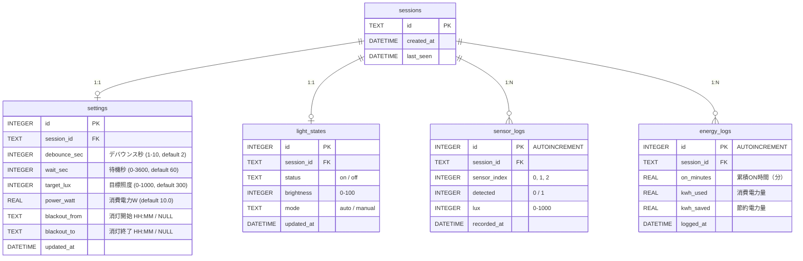

# ER 図

## 設計上の注意点

- `settings` / `light_states` は session ごとに 1 行（UNIQUE(session_id)）
- `sensor_logs` / `energy_logs` は追記のみ（更新・削除なし）
- 全クエリに `WHERE session_id = ?` を付与してセッション分離を保証
- マスタデータ（制御モード・照明状態・センサー状態の定数）は DB に保存せずコード内定数で管理
- JST 03:00 に全テーブルの全行を削除（`DELETE FROM ...` 順は FK 制約を考慮）
