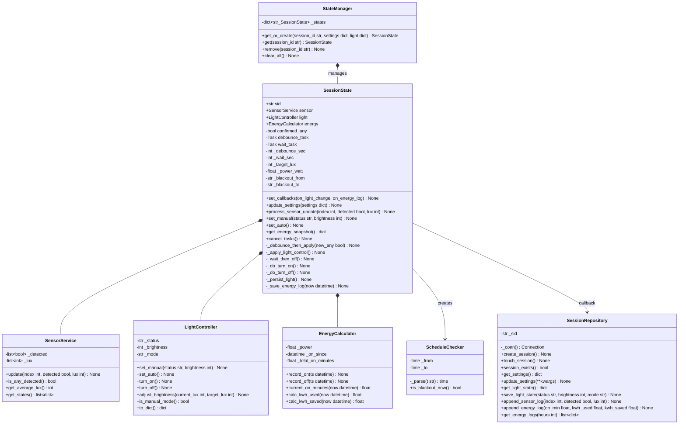

# クラス図

## 設計方針

| クラス | 責務 |
|---|---|
| `SensorService` | 3センサーの raw 状態を保持・集約 |
| `LightController` | 照明の状態遷移・P制御輝度調整 |
| `EnergyCalculator` | ON/OFF 時刻から kWh を計算 |
| `ScheduleChecker` | 現在時刻が消灯時間帯かを判定（日またぎ対応） |
| `SessionState` | セッションごとの in-memory ステートマシン（asyncio タスク管理） |
| `StateManager` | SessionState のグローバルレジストリ（シングルトン） |
| `SessionRepository` | SQLite への全 DB 操作（session_id フィルタ必須） |
