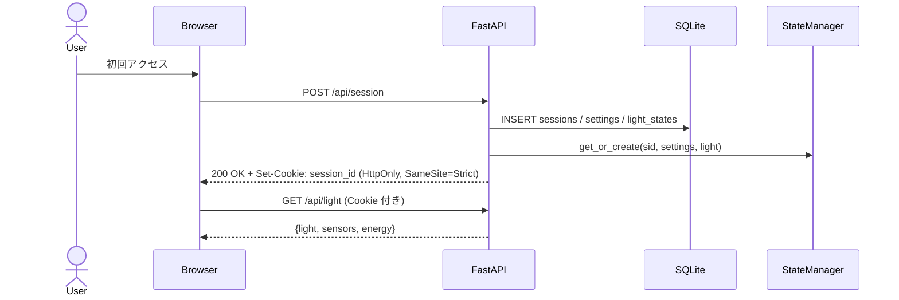
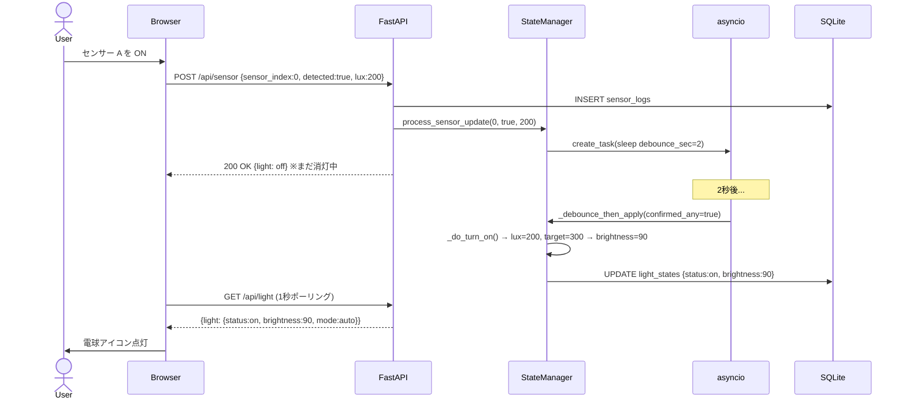
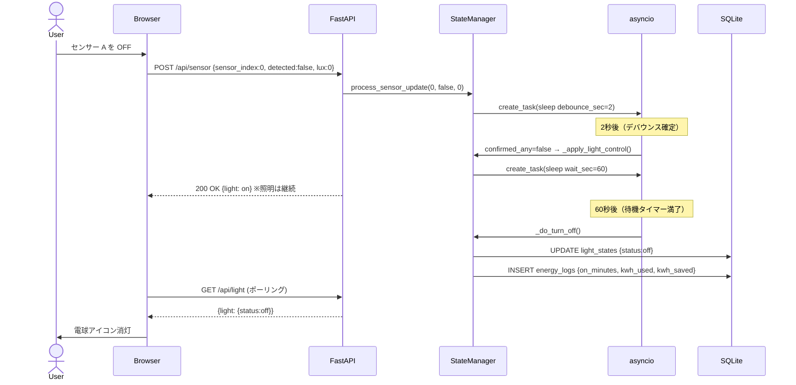
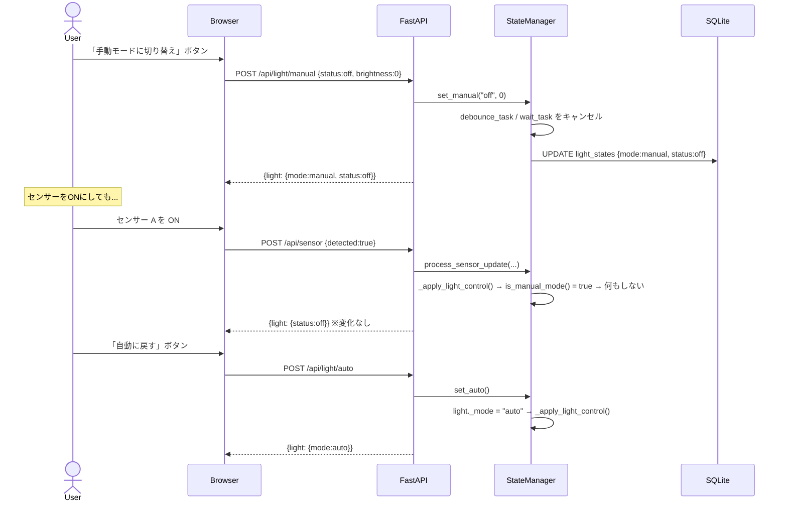
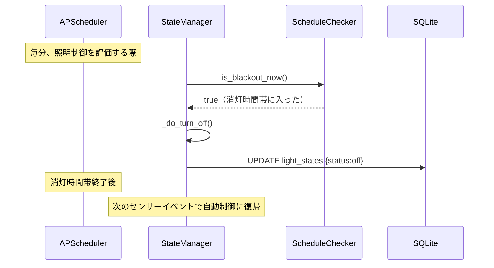
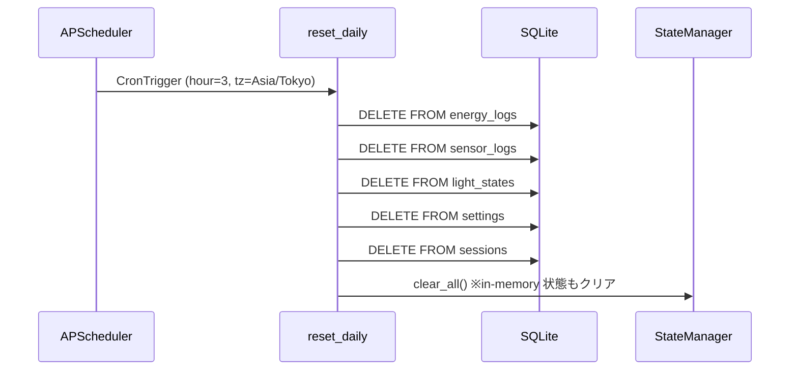

# シーケンス図

## 1. セッション作成フロー

```mermaid
sequenceDiagram
    actor User
    participant Browser
    participant FastAPI
    participant SQLite
    participant StateManager

    User->>Browser: 初回アクセス
    Browser->>FastAPI: POST /api/session
    FastAPI->>SQLite: INSERT sessions / settings / light_states
    FastAPI->>StateManager: get_or_create(sid, settings, light)
    FastAPI-->>Browser: 200 OK + Set-Cookie: session_id (HttpOnly, SameSite=Strict)
    Browser->>FastAPI: GET /api/light (Cookie 付き)
    FastAPI-->>Browser: {light, sensors, energy}
```

---

## 2. センサー検知 → 点灯フロー（デバウンス込み）

```mermaid
sequenceDiagram
    actor User
    participant Browser
    participant FastAPI
    participant StateManager
    participant asyncio
    participant SQLite

    User->>Browser: センサー A を ON
    Browser->>FastAPI: POST /api/sensor {sensor_index:0, detected:true, lux:200}
    FastAPI->>SQLite: INSERT sensor_logs
    FastAPI->>StateManager: process_sensor_update(0, true, 200)
    StateManager->>asyncio: create_task(sleep debounce_sec=2)
    FastAPI-->>Browser: 200 OK {light: off} ※まだ消灯中

    Note over asyncio: 2秒後...
    asyncio->>StateManager: _debounce_then_apply(confirmed_any=true)
    StateManager->>StateManager: _do_turn_on() → lux=200, target=300 → brightness=90
    StateManager->>SQLite: UPDATE light_states {status:on, brightness:90}

    Browser->>FastAPI: GET /api/light (1秒ポーリング)
    FastAPI-->>Browser: {light: {status:on, brightness:90, mode:auto}}
    Browser->>User: 電球アイコン点灯
```

---

## 3. 離席 → 待機タイマー → 自動消灯フロー

```mermaid
sequenceDiagram
    actor User
    participant Browser
    participant FastAPI
    participant StateManager
    participant asyncio
    participant SQLite

    User->>Browser: センサー A を OFF
    Browser->>FastAPI: POST /api/sensor {sensor_index:0, detected:false, lux:0}
    FastAPI->>StateManager: process_sensor_update(0, false, 0)
    StateManager->>asyncio: create_task(sleep debounce_sec=2)

    Note over asyncio: 2秒後（デバウンス確定）
    asyncio->>StateManager: confirmed_any=false → _apply_light_control()
    StateManager->>asyncio: create_task(sleep wait_sec=60)
    FastAPI-->>Browser: 200 OK {light: on} ※照明は継続

    Note over asyncio: 60秒後（待機タイマー満了）
    asyncio->>StateManager: _do_turn_off()
    StateManager->>SQLite: UPDATE light_states {status:off}
    StateManager->>SQLite: INSERT energy_logs {on_minutes, kwh_used, kwh_saved}

    Browser->>FastAPI: GET /api/light (ポーリング)
    FastAPI-->>Browser: {light: {status:off}}
    Browser->>User: 電球アイコン消灯
```

---

## 4. 手動モード切替フロー

```mermaid
sequenceDiagram
    actor User
    participant Browser
    participant FastAPI
    participant StateManager
    participant SQLite

    User->>Browser: 「手動モードに切り替え」ボタン
    Browser->>FastAPI: POST /api/light/manual {status:off, brightness:0}
    FastAPI->>StateManager: set_manual("off", 0)
    StateManager->>StateManager: debounce_task / wait_task をキャンセル
    StateManager->>SQLite: UPDATE light_states {mode:manual, status:off}
    FastAPI-->>Browser: {light: {mode:manual, status:off}}

    Note over User: センサーをONにしても...
    User->>Browser: センサー A を ON
    Browser->>FastAPI: POST /api/sensor {detected:true}
    FastAPI->>StateManager: process_sensor_update(...)
    StateManager->>StateManager: _apply_light_control() → is_manual_mode() = true → 何もしない
    FastAPI-->>Browser: {light: {status:off}} ※変化なし

    User->>Browser: 「自動に戻す」ボタン
    Browser->>FastAPI: POST /api/light/auto
    FastAPI->>StateManager: set_auto()
    StateManager->>StateManager: light._mode = "auto" → _apply_light_control()
    FastAPI-->>Browser: {light: {mode:auto}}
```

---

## 5. 消灯スケジュール割り込みフロー

```mermaid
sequenceDiagram
    participant APScheduler
    participant StateManager
    participant ScheduleChecker
    participant SQLite

    Note over APScheduler: 毎分、照明制御を評価する際
    StateManager->>ScheduleChecker: is_blackout_now()
    ScheduleChecker-->>StateManager: true（消灯時間帯に入った）
    StateManager->>StateManager: _do_turn_off()
    StateManager->>SQLite: UPDATE light_states {status:off}

    Note over APScheduler: 消灯時間帯終了後
    Note over StateManager: 次のセンサーイベントで自動制御に復帰
```

---

## 6. 毎日 JST 03:00 DB リセット

```mermaid
sequenceDiagram
    participant APScheduler
    participant reset_daily
    participant SQLite
    participant StateManager

    APScheduler->>reset_daily: CronTrigger (hour=3, tz=Asia/Tokyo)
    reset_daily->>SQLite: DELETE FROM energy_logs
    reset_daily->>SQLite: DELETE FROM sensor_logs
    reset_daily->>SQLite: DELETE FROM light_states
    reset_daily->>SQLite: DELETE FROM settings
    reset_daily->>SQLite: DELETE FROM sessions
    reset_daily->>StateManager: clear_all() ※in-memory 状態もクリア
```
