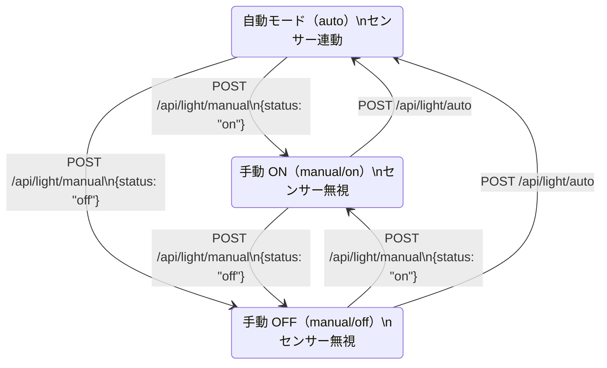
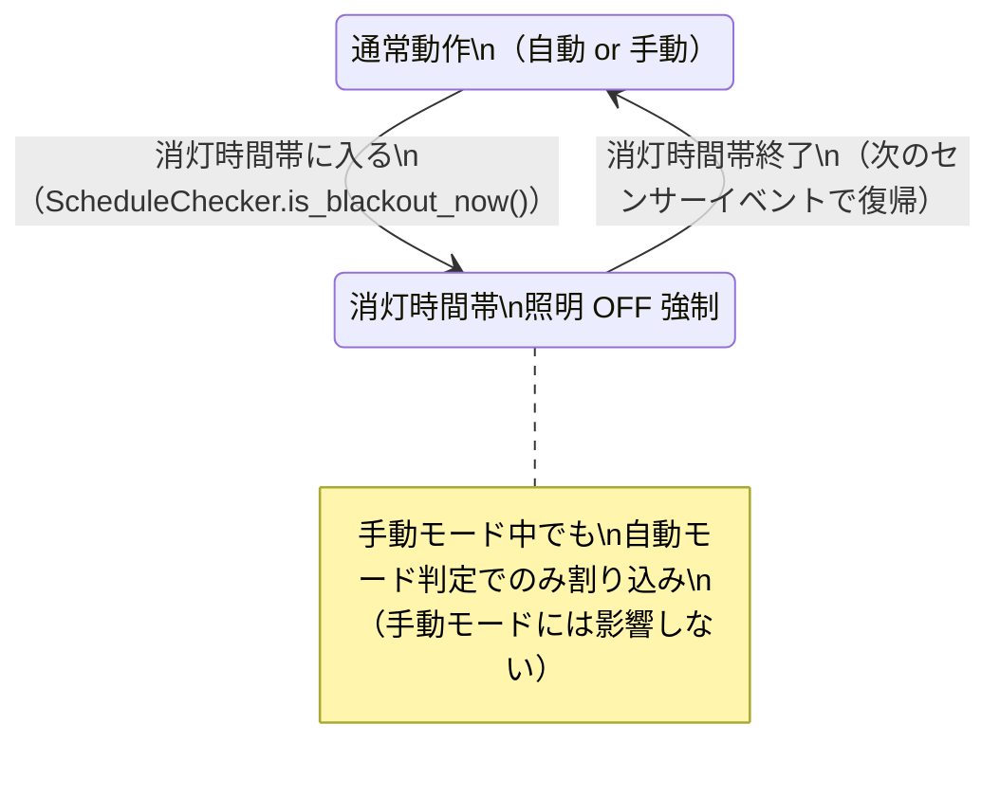
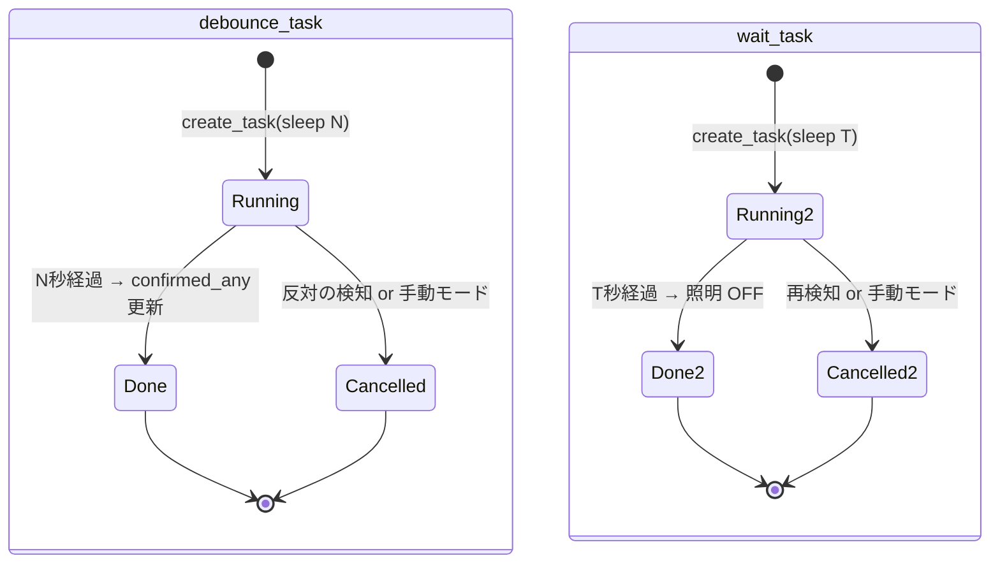

# 状態遷移図

## 照明の状態遷移（自動モード）

```mermaid
stateDiagram-v2
    [*] --> IDLE : 初期状態

    IDLE : IDLE（待機中）\n照明 OFF
    DEBOUNCE_ON : DEBOUNCE_ON（デバウンス中）\n照明 OFF・タイマー実行中
    OCCUPIED : OCCUPIED（在室）\n照明 ON・輝度自動調整
    WAIT_TIMER : WAIT_TIMER（離席待機）\n照明 ON・タイマー実行中
    OFF : OFF（消灯）\n照明 OFF

    IDLE --> DEBOUNCE_ON : センサー検知\n（any_detected 変化）
    DEBOUNCE_ON --> IDLE : デバウンス中に\n検知なしに戻る
    DEBOUNCE_ON --> OCCUPIED : デバウンス確定\n（N秒継続・消灯時間帯外）
    DEBOUNCE_ON --> OFF : デバウンス確定\n（消灯時間帯中）

    OCCUPIED --> WAIT_TIMER : センサー未検知確定\n（デバウンス N秒後）
    WAIT_TIMER --> OCCUPIED : 再検知（wait_task キャンセル）
    WAIT_TIMER --> OFF : タイマー満了（T秒）

    OFF --> DEBOUNCE_ON : センサー検知

    note right of DEBOUNCE_ON : debounce_sec: 1-10秒\n(デフォルト 2秒)
    note right of WAIT_TIMER : wait_sec: 0-3600秒\n(デフォルト 60秒)
```

---

## 手動モードの状態遷移



---

## 消灯スケジュール割り込み



---

## asyncio タスクのライフサイクル


