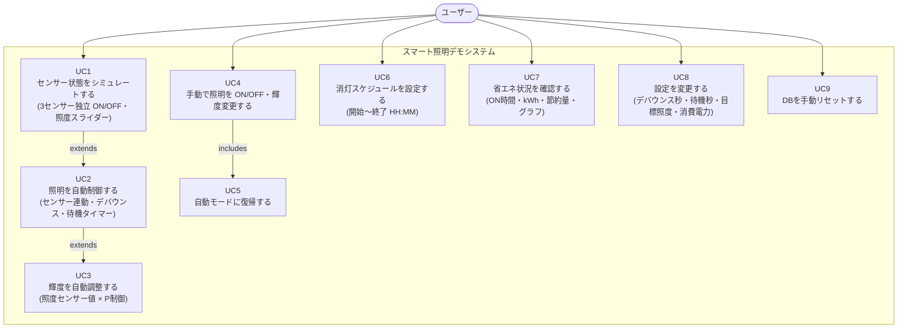
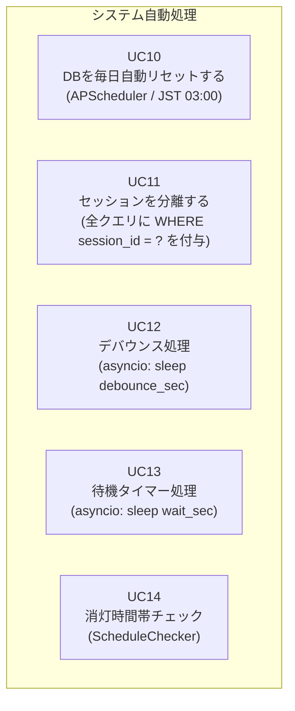

# ユースケース図

## ユーザーユースケース

---

## システム自動処理ユースケース

---

## API ユースケースマッピング

| ユースケース | API エンドポイント | 実装クラス |
|---|---|---|
| UC1 センサーシミュレート | `POST /api/sensor` | `SensorService.update()` |
| UC2 照明自動制御 | (asyncio タスク) | `SessionState._apply_light_control()` |
| UC3 輝度自動調整 | (UC2 内) | `LightController.adjust_brightness()` |
| UC4 手動制御 | `POST /api/light/manual` | `SessionState.set_manual()` |
| UC5 自動復帰 | `POST /api/light/auto` | `SessionState.set_auto()` |
| UC6 消灯スケジュール | `PUT /api/settings` | `ScheduleChecker.is_blackout_now()` |
| UC7 省エネ確認 | `GET /api/energy` | `EnergyCalculator.calc_*()` |
| UC8 設定変更 | `PUT /api/settings` | `SessionRepository.update_settings()` |
| UC9 手動リセット | `POST /api/admin/reset` | `reset_all_data()` |
| UC10 自動リセット | (APScheduler Cron) | `tasks/db_reset.py` |
| UC11 セッション分離 | 全エンドポイント | `SessionRepository._sid` フィルタ |
| UC12 デバウンス | `POST /api/sensor` 後 | `asyncio.create_task(sleep N)` |
| UC13 待機タイマー | (UC2 内) | `asyncio.create_task(sleep T)` |
| UC14 消灯時間帯 | (UC2 内) | `ScheduleChecker.is_blackout_now()` |
